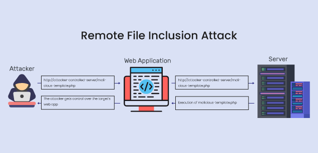

# Remote File Inclusion (RFI) Vulnerability

Remote File Inclusion (RFI) is a type of vulnerability that allows an attacker to include files on a server through the web browser. This can lead to executing malicious scripts on the server or compromising the server's security.

## Example Scenario
Consider a web application that dynamically includes external files or scripts based on user input without proper validation. An attacker can exploit this by crafting a URL that causes the application to include a remote file that contains malicious code.

## Steps to Exploit RFI
1. **Identify the Vulnerable Parameter**: The attacker finds the parameter that the web application uses to include external files.
2. **Craft Malicious URL**: The attacker crafts a URL that includes a path to a malicious file hosted on a remote server.
3. **Server Executes Malicious File**: If the web application includes the remote file, the server executes the malicious script, leading to potential unauthorized access or damage.

